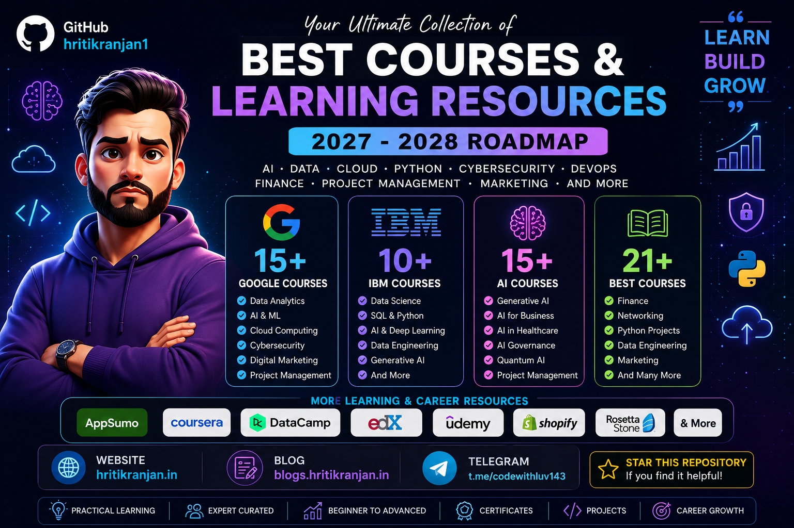

<p align="center">
  
</p>

<p align="center">
  
</p>

<h1 align="center">
  🚀 Complete Learning & Career Resources | 2027–2028
</h1>

<p align="center">
  <strong>
    A curated collection of learning resources for AI, Data Analytics,
    Python, Data Engineering, Cybersecurity, Cloud, Networking,
    Finance, Digital Marketing, Project Management, DevOps and Generative AI.
  </strong>
</p>

<p align="center">
  📚 Learn &nbsp;→&nbsp;
  🧪 Practice &nbsp;→&nbsp;
  🛠️ Build &nbsp;→&nbsp;
  🐙 Share &nbsp;→&nbsp;
  🚀 Grow
</p>

<p align="center">
  <a href="https://github.com/hritikranjan1">
    
  </a>

  <a href="https://hritikranjan.in">
    
  </a>

  <a href="https://blogs.hritikranjan.in/">
    
  </a>

  <a href="https://t.me/codewithluv143">
    
  </a>
</p>

<p align="center">
  
  
  
  
  
  
  
</p>

---

# 🌟 About This Repository

Welcome to the **Complete Learning & Career Resources Repository**! 🚀

This repository is designed as a centralized learning hub for students, developers, QA engineers, DevOps engineers, cloud learners, cybersecurity enthusiasts, data professionals, project managers, business professionals and anyone interested in continuous learning.

The goal is simple:

> **Learn → Practice → Build → Document → Share → Grow**

Instead of searching for useful resources again and again, this repository brings them together in one place.

---

# 🎯 What You Will Find Here

- 🤖 Artificial Intelligence
- 🧠 Generative AI
- 📊 Data Analytics
- 🐍 Python
- ⚙️ Data Engineering
- ☁️ Cloud Computing
- 🌐 Computer Networking
- 🔐 Cybersecurity
- ⚙️ DevOps
- 📋 Project Management
- 💰 Finance
- 📈 Digital Marketing
- 🧩 Business Analysis
- 🚀 Career Development
- 🎓 Professional Learning
- 🛠️ Project Ideas
- 📚 Learning Roadmaps

---

# 📊 Repository Overview

| Category | Resources |
|---|---:|
| 🤖 AI Courses | 15 |
| 🔵 Google Courses | 15 |
| 🟣 IBM Courses | 10 |
| 🔥 Best Courses 2027–2028 | 21 |
| 🌟 Learning & Career Resources | 14 |
| 📖 Personal Resources | 4+ |

---

# 📚 Table of Contents

- [🌟 About This Repository](#-about-this-repository)
- [🎯 What You Will Find Here](#-what-you-will-find-here)
- [📊 Repository Overview](#-repository-overview)
- [🤖 AI Courses](#-ai-courses)
- [🔵 Google Courses](#-google-courses)
- [🟣 IBM Courses](#-ibm-courses)
- [🔥 Best Courses 2027–2028](#-best-courses-20272028)
- [🌟 Learning & Career Resources](#-learning--career-resources)
- [🗺️ Recommended Learning Roadmaps](#️-recommended-learning-roadmaps)
- [📊 Data Analytics Roadmap](#-data-analytics-roadmap)
- [🐍 Python Roadmap](#-python-roadmap)
- [☁️ Cloud & DevOps Roadmap](#️-cloud--devops-roadmap)
- [🔐 Cybersecurity Roadmap](#-cybersecurity-roadmap)
- [🤖 AI Roadmap](#-ai-roadmap)
- [🧪 How to Learn Effectively](#-how-to-learn-effectively)
- [🛠️ Project Ideas](#️-project-ideas)
- [📂 Recommended GitHub Project Structure](#-recommended-github-project-structure)
- [📈 Career Roadmap](#-career-roadmap)
- [💡 Learning Checklist](#-learning-checklist)
- [🧠 Golden Rules](#-golden-rules)
- [📖 My Resources](#-my-resources)
- [🌐 Useful Links](#-useful-links)
- [⭐ Support This Repository](#-support-this-repository)
- [🔄 Future Updates](#-future-updates)
- [⚠️ Affiliate Disclosure](#️-affiliate-disclosure)

---

# 🤖 AI Courses

> 🚀 Explore AI fundamentals, Python, AI infrastructure, Generative AI, AI governance and specialized AI applications.

| # | Course | Link |
|---:|---|---|
| 1 | AI For Everyone | [Start Course ↗](https://imp.i384100.net/jeaEZ5) |
| 2 | AI Python for Beginners | [Start Course ↗](https://imp.i384100.net/B5bEAy) |
| 3 | AI Infrastructure and Operations Fundamentals | [Start Course ↗](https://imp.i384100.net/OYEqWG) |
| 4 | Generative AI for Human Resources (HR) Professionals | [Start Course ↗](https://imp.i384100.net/dyrBry) |
| 5 | AI Fundamentals | [Start Course ↗](https://imp.i384100.net/bkQXqv) |
| 6 | AI for Healthcare | [Start Course ↗](https://imp.i384100.net/qWoMoO) |
| 7 | AI Applications in Accounting and Finance | [Start Course ↗](https://imp.i384100.net/DWaoaq) |
| 8 | AI Governance and Privacy Professional Certification (AIGP) | [Start Course ↗](https://imp.i384100.net/Pznxnq) |
| 9 | Ethics and Governance in the Age of Generative AI | [Start Course ↗](https://imp.i384100.net/1GzxzB) |
| 10 | Hands-on quantum error correction with Google Quantum AI | [Start Course ↗](https://imp.i384100.net/zzOMO7) |
| 11 | AI-Powered Higher Education | [Start Course ↗](https://imp.i384100.net/MKEOYN) |
| 12 | Modern Project Leadership: Agile, AI, and Beyond | [Start Course ↗](https://imp.i384100.net/qWoMGq) |
| 13 | AI-Powered Business Analysis: Excel, KPIs & GenAI | [Start Course ↗](https://imp.i384100.net/9VqkBY) |
| 14 | AI in Law: Research, Risk, and Legal Drafting | [Start Course ↗](https://imp.i384100.net/5kzrBo) |
| 15 | Generative AI for Project Managers | [Start Course ↗](https://imp.i384100.net/Gb1WY6) |

---

# 🔵 Google Courses

> 🌐 Explore Data Analytics, AI, Cybersecurity, Networking, Cloud, Digital Marketing and Project Management.

| # | Course | Link |
|---:|---|---|
| 1 | Foundations: Data, Data, Everywhere | [Start Course ↗](https://imp.i384100.net/jRZX4a) |
| 2 | Ask Questions to Make Data-Driven Decisions | [Start Course ↗](https://imp.i384100.net/Gb1WEm) |
| 3 | Prepare Data for Exploration | [Start Course ↗](https://imp.i384100.net/zzOMRr) |
| 4 | Agile Project Management | [Start Course ↗](https://imp.i384100.net/qWoMVY) |
| 5 | Project Initiation: Starting a Successful Project | [Start Course ↗](https://imp.i384100.net/JkZnjq) |
| 6 | AI Fundamentals | [Start Course ↗](https://imp.i384100.net/bkQXqv) |
| 7 | Foundations of Digital Marketing and E-commerce | [Start Course ↗](https://imp.i384100.net/YVKejP) |
| 8 | Play It Safe: Manage Security Risks | [Start Course ↗](https://imp.i384100.net/aNDgLR) |
| 9 | The Bits and Bytes of Computer Networking | [Start Course ↗](https://imp.i384100.net/L0E65M) |
| 10 | Analyze Data to Answer Questions | [Start Course ↗](https://imp.i384100.net/vDmM0v) |
| 11 | Automate Cybersecurity Tasks with Python | [Start Course ↗](https://imp.i384100.net/YVKe3e) |
| 12 | Architecting with Google Compute Engine | [Start Course ↗](https://imp.i384100.net/jRabAM) |
| 13 | AI for Writing and Communicating | [Start Course ↗](https://imp.i384100.net/9Vqk3E) |
| 14 | From Likes to Leads: Interact with Customers Online | [Start Course ↗](https://imp.i384100.net/YVKexr) |
| 15 | AI for Data Analysis | [Start Course ↗](https://imp.i384100.net/L0E6q0) |

---

# 🟣 IBM Courses

> 💙 Explore SQL, Python, Data Analytics, Deep Learning, RAG and Generative AI resources.

| # | Course | Link |
|---:|---|---|
| 1 | Databases and SQL for Data Science with Python | [Start Course ↗](https://imp.i384100.net/9VqkPE) |
| 2 | RAG and Agentic AI Capstone Project | [Start Course ↗](https://imp.i384100.net/Pznx9R) |
| 3 | Excel Basics for Data Analysis | [Start Course ↗](https://imp.i384100.net/Gb1WB2) |
| 4 | Introduction to Data Analytics | [Start Course ↗](https://imp.i384100.net/1GzxLz) |
| 5 | Data Visualization and Dashboards with Excel and Cognos | [Start Course ↗](https://imp.i384100.net/X4EkA3) |
| 6 | IBM AI Foundations for Business | [Start Course ↗](https://imp.i384100.net/zzOM3G) |
| 7 | AI Capstone Project with Deep Learning | [Start Course ↗](https://imp.i384100.net/6kzj9m) |
| 8 | Python Project for Data Engineering | [Start Course ↗](https://imp.i384100.net/B5kge9) |
| 9 | Building Generative AI-Powered Applications with Python | [Start Course ↗](https://imp.i384100.net/MKEOzn) |
| 10 | Vector Databases for RAG: An Introduction | [Start Course ↗](https://imp.i384100.net/m41MqO) |

---

# 🔥 Best Courses 2027–2028

> 🎯 A broader collection covering AI, Data, Python, Finance, Cybersecurity, Marketing, Networking, Management and Data Engineering.

| # | Course | Link |
|---:|---|---|
| 1 | AI For Everyone | [Start Course ↗](https://imp.i384100.net/jeaEZ5) |
| 2 | Foundations: Data, Data, Everywhere | [Start Course ↗](https://imp.i384100.net/jRZX4a) |
| 3 | Ask Questions to Make Data-Driven Decisions | [Start Course ↗](https://imp.i384100.net/Gb1Wem) |
| 4 | Prepare Data for Exploration | [Start Course ↗](https://imp.i384100.net/zzOMRr) |
| 5 | Financial Markets | [Start Course ↗](https://imp.i384100.net/7Xoexg) |
| 6 | Agile Project Management | [Start Course ↗](https://imp.i384100.net/qWoMVY) |
| 7 | Play It Safe: Manage Security Risks | [Start Course ↗](https://imp.i384100.net/aNDgLR) |
| 8 | Project Initiation: Starting a Successful Project | [Start Course ↗](https://imp.i384100.net/JkZnjq) |
| 9 | AI Fundamentals | [Start Course ↗](https://imp.i384100.net/bkQXqv) |
| 10 | Analyze Data to Answer Questions | [Start Course ↗](https://imp.i384100.net/vDmM0v) |
| 11 | Foundations of Digital Marketing and E-commerce | [Start Course ↗](https://imp.i384100.net/YVKejP) |
| 12 | The Bits and Bytes of Computer Networking | [Start Course ↗](https://imp.i384100.net/L0E65M) |
| 13 | Sequence Models | [Start Course ↗](https://imp.i384100.net/rEWM0v) |
| 14 | Federal Taxation I: Individuals, Employees, and Sole Proprietors | [Start Course ↗](https://imp.i384100.net/k4A6kL) |
| 15 | Designing the Organization | [Start Course ↗](https://imp.i384100.net/enjzQO) |
| 16 | Game Theory | [Start Course ↗](https://imp.i384100.net/L0E6oa) |
| 17 | Using Python to Access Web Data | [Start Course ↗](https://imp.i384100.net/5kzrmn) |
| 18 | Viral Marketing and How to Craft Contagious Content | [Start Course ↗](https://imp.i384100.net/JkZnoQ) |
| 19 | Python Project for Data Engineering | [Start Course ↗](https://imp.i384100.net/B5kge9) |
| 20 | Value Chain Management | [Start Course ↗](https://imp.i384100.net/OYEqoA) |
| 21 | Applying Data Analytics in Finance | [Start Course ↗](https://imp.i384100.net/4aM9R1) |

---

# 🌟 Learning & Career Resources

> 💡 Additional resources for learning, career development, language learning, hosting, education and professional growth.

| Category | Program | Tracking Link |
|---|---|---|
| 📱 Apps | **AppSumo** | https://appsumo.8odi.net/c/5203965/416948/7443 |
| 🌐 Website Hosting | **Automattic, Inc. (WordPress.com, Pressable, WooCommerce, Jetpack)** | https://automattic.pxf.io/c/5203965/1900456/22744 |
| 🇬🇧 College | **British Council - EOL English Online** | https://englishonline.sjv.io/c/5203965/1152772/14579 |
| 📚 Educational | **Carson Dellosa Education** | https://carsondellosaeducation.sjv.io/c/5203965/2241626/29119 |
| 🎓 College | **Coursera B2C Affiliate Program** | https://imp.i384100.net/c/5203965/1164545/14726 |
| 📊 Learning | **DataCamp** | https://datacamp.pxf.io/c/5203965/1012793/13294 |
| 🎨 Collectibles & Hobbies | **Domestika** | https://domestika.sjv.io/c/5203965/1492994/17608 |
| 🎓 College | **edX** | https://edx.sjv.io/c/5203965/1505390/17728 |
| 💼 Career | **Medical Spanish** | https://curiositymediainc.sjv.io/c/5203965/2899794/33984 |
| 🧪 Educational | **MEL Science** | https://imp.i328067.net/c/5203965/574569/9515 |
| 🗣️ Apps | **Preply Learners** | https://preply.sjv.io/c/5203965/1987575/24422 |
| 🌍 Learning | **Rosetta Stone** | https://aff.rosettastone.com/c/5203965/1637427/18979 |
| 🛍️ Website Hosting | **Shopify** | https://shopify.pxf.io/c/5203965/1061744/13624 |
| 🎯 Learning | **Udemy** | https://trk.udemy.com/c/5203965/3193860/39854 |

---

# 🗺️ Recommended Learning Roadmaps

> Choose one roadmap according to your career goal. You don't need to learn everything at once.

---

# 🤖 AI Roadmap

```text
AI Fundamentals
      ↓
Python Basics
      ↓
Mathematics & Statistics
      ↓
Data Fundamentals
      ↓
Machine Learning
      ↓
Deep Learning
      ↓
Generative AI
      ↓
Prompt Engineering
      ↓
RAG
      ↓
Vector Databases
      ↓
Agentic AI
      ↓
AI Applications
      ↓
Real-World Projects
      ↓
GitHub Portfolio
